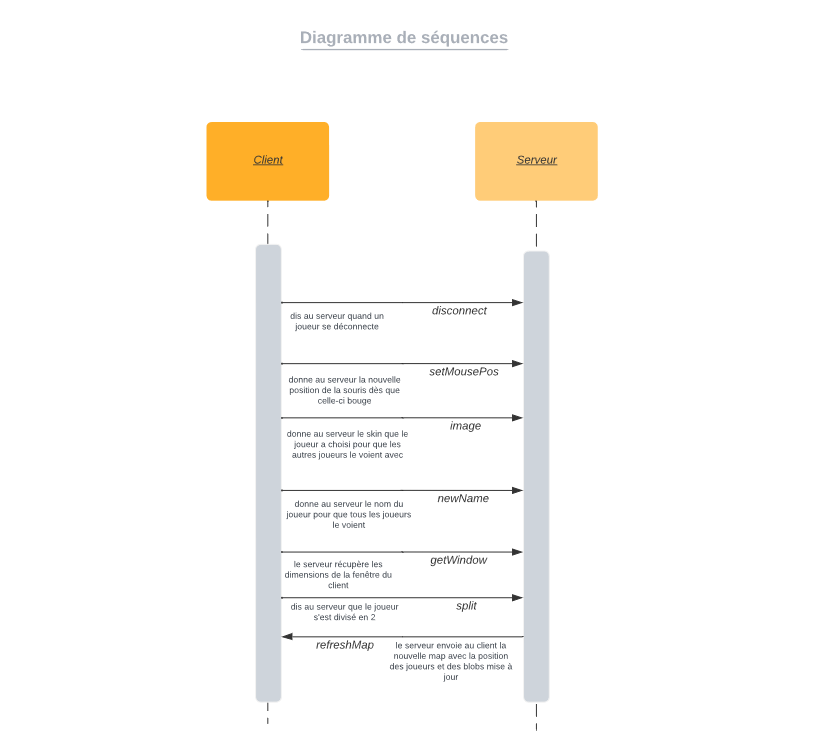

# JSae

Nous avons appelé notre petit jeu <mark> Agar.IUT</mark>, dedans, vous êtes un petit blob qui essaye de devenir le plus gros blob du MONDE! Pour se faire, vous allez commencer par manger de la nourriture un peu partout sur le plateau, puis vous vous attaquerez ensuite aux autres joueurs! 

Ce jeu a été codé en JavaScript par Morgan Secretin, Milan Delzenne et Léa Bedrici. 

##  Diagramme de séquence

Nous avons utilisé WebSocket.io pour avoir une relation client/serveur. 
Voici le diagramme de séquence répertoriant les différents échanges entre les deux:

## Difficultés

- Garder le joueur au milieu dans la vue client : il a fallu tester beaucoup de façons de translate jusqu'à tomber sur la bonne.
- Le système de split (qui n'était pas dans le cahier des charges).
- Le typescript car il est arrivé très tardivement donc il à fallu modifier l'intégralité du code ce qui à pris un certain temps et reformatage du code.
- Le scale selon la taille du joueur : on n'a pas réussi au final donc pour remédier au problème on a calculé la taille différemment pour faire en sorte que plus le joueur est gros, plus il est difficile de gagner en taille, ainsi, il est peu probable qu'il finisse par prendre tout l'écran. 
- Le classement qui nous a donné du fil à retordre puisque le serveur n'avait plus accès au fichier json une fois un joueur déconnecté. 

## Pistes d'amélioration

- On a voulu ajouter le système de split mais il y'a quelques problèmes qui viennent avec, on aurait voulu pouvoir faire en sorte de split plusieurs fois et que le mouvement soit un peu moins rigide, qu'il y ait une animation et que les "morceaux" du joueur soient attirés vers le joueur après un certain temps. Cependant, vu le manque de temps et la difficulté de l'implémentation nous sommes restés à quelque chose d'accessible. 
- On a pas réussi à implémenter le scale quand le joueur grandit, ce serait donc quelque chose à faire. 
- Pourquoi pas ajouter un "dark mode" et quelques personnalisations en plus. 
- Si on veut se rapprocher du véritable Agar.io, implémenter les virus qui divisent le joueur en 8 (mais déjà que diviser le joueur en 2 c'est compliqué alors là...) puis le 'W' qui permet de lancer une petite partie de soi.

## Nos petites fiertés

- On est la meilleur équipe : -> un projet fait par tout le monde -> une bonne entente et motivation -> une bonne organisation et communication
- La bonne correction d'erreur : nous sommes 3 et donc nous avons chacun un regard diffèrent sur un problème
- L'animation qui au final est plutôt fluide
- L'organisation du code
- Le split 
- Les skins (les images des joueurs) et le nom qui s'affichent
- La musique et les sons (alors oui c'est pas incroyable niveau technique mais ça rends le jeu bien plus sympa)
- Le magnifique css (inspiré à moitié de celui des TPs de JavaScript mais chut, il faut pas dire)
- Le classement qui s'update parfaitement
  

### INSTALLATION :
- Node module
>npm i

- Typescript
>npm install --save-dev typescript

>npm i -D nodemon ts-node

>npm i -D ts-loader

- Jest
>npm install --save-dev jest

>npm install --save-dev @types/jest

>npm install --save-dev ts-jest

- Jest
- // Cette dernière commande est indispensable pour gérer une de nos options de configuration
>npm exec ts-jest config:init

>mv jest.config.js jest.config.cjs

### LANCER LE SERVER
>npm run dev

>npm run watch:server

>npm run watch:client
# Agar.iut

